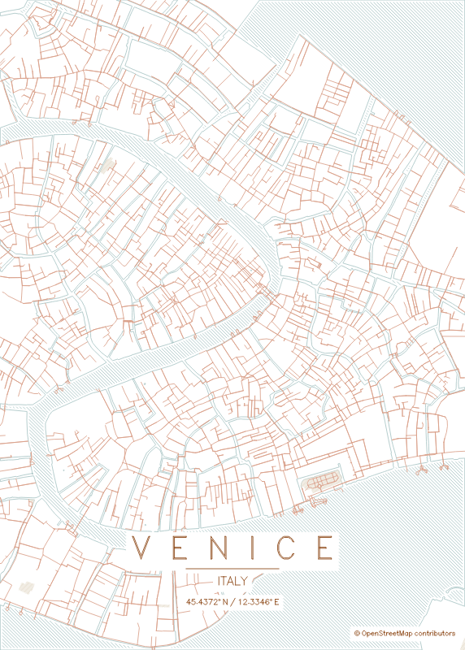
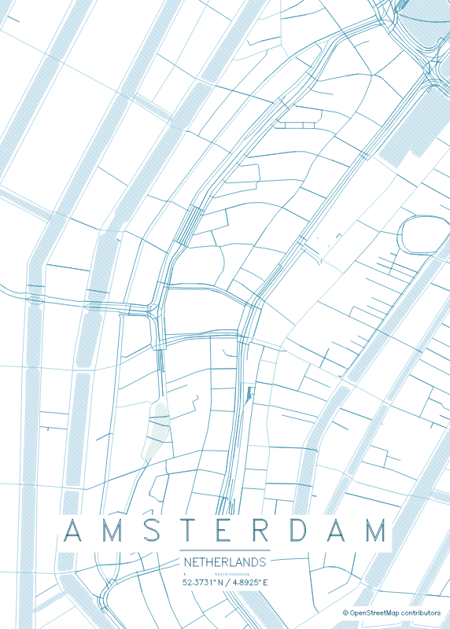
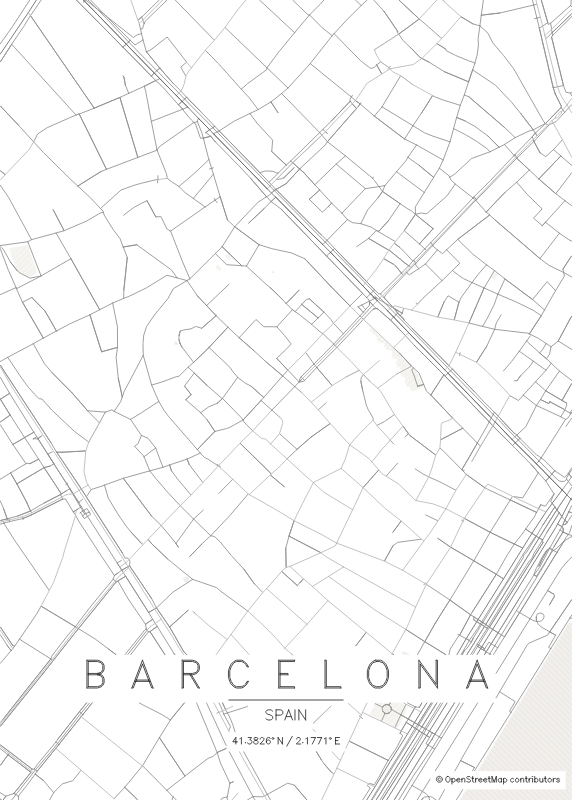
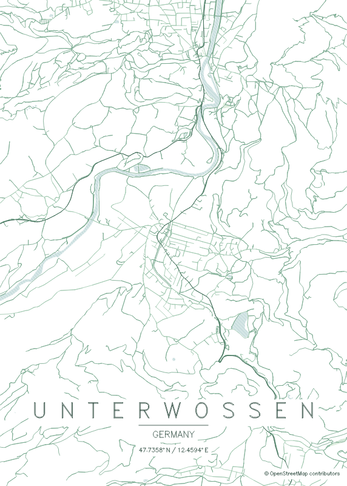

# map2plotter

Turn any city into a minimalist map poster for your **pen plotter**: a stroke-only SVG in real millimetres, with hatched or contour-filled water and parks, single-line text, and one Inkscape layer per pen colour. Design it in your browser, then plot it.

> **Based on [maptoposter](https://github.com/originalankur/maptoposter)** by Ankur Gupta and its contributors, which is no longer maintained. map2plotter continues it under the same [MIT license](LICENSE).

| | | | |
|:-:|:-:|:-:|:-:|
|  |  |  |  |
| Venice | Amsterdam | Barcelona | Unterwössen |

## Get started

map2plotter runs in [Docker](https://www.docker.com/), so you don't need to install Python or anything else.

1. **Install Docker Desktop** from [docker.com](https://www.docker.com/products/docker-desktop/) (Windows, macOS or Linux) and start it.
2. **Create a folder** for your posters, for example `map2plotter`.
3. **Save this file** in that folder as `compose.yaml`:

   ```yaml
   services:
     map2plotter:
       image: ghcr.io/dirnei/map2plotter:latest
       ports:
         - "127.0.0.1:8000:8000"
       volumes:
         - ./posters:/app/posters   # your finished SVGs
         - ./cache:/app/cache       # downloaded map data, reused next time
       restart: unless-stopped
   ```

4. **Open a terminal in that folder** and start it:

   ```bash
   docker compose up -d
   ```

   (On Windows: open the folder in Explorer, type `cmd` in the address bar and press Enter.)

5. **Open <http://localhost:8000>** in your browser. (If port 8000 is already in use, change the first `8000` in `compose.yaml`, e.g. to `8080`, and open that port instead.)

Enter a city, press **Load map**, pick your pens and fills on the live preview, and press **Export poster**. The SVG appears in the `posters` folder, ready for your plotter software or Inkscape.

To stop it: `docker compose down`. To update to the newest version: `docker compose pull && docker compose up -d`.

## Using the web interface

1. **Location**: city and country, how much of the city to show (distance), and the paper size in mm.
2. **Customize**:
   - **Pens**: one colour per element (water, parks, each road class, text). Elements with the same colour share a pen. Start from a theme, or use a single black pen.
   - **Fills**: pen width, hatched or contour fill for water and parks, and line spacing.
   - **Edit the preview**: erase parts of the map, drag the text, hide lines.
3. **Export poster** writes the SVG to `posters/`.

## Plotting tips

- Every colour is its own Inkscape layer: plot one pen, swap it, plot the next.
- Paths are already sorted to keep pen-up travel short. [vpype](https://github.com/abey79/vpype) can optimise further, and keeps the layers: `vpype read poster.svg linemerge linesort write optimized.svg`.
- Text uses a single-line pen font that covers Latin script only. Other characters are skipped.
- `noir`, `blueprint`, `emerald`, `neon_cyberpunk` and `midnight_blue` have light pens, made for dark paper.

## Command line

The same image also runs the command-line tool. In your folder:

```bash
docker compose run --rm map2plotter -c "Venice" -C "Italy" -d 3000 -W 297 -H 420
docker compose run --rm map2plotter --help
```

Without Docker, with [uv](https://docs.astral.sh/uv/) in a clone of this repository: `uv sync`, then `uv run map2plotter …` or `uv run map2plotter-web`.

## More

- [Reference](docs/reference.md): every option, OpenStreetMap servers, edit lists, custom themes and releases
- [Changelog](CHANGELOG.md)
